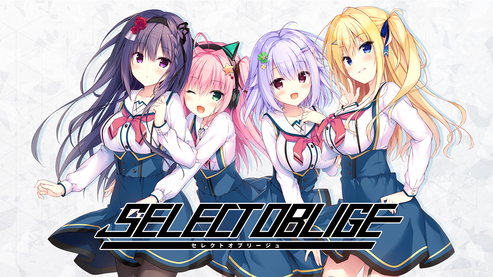

# Select Oblige Re-Translation Patch

Replaces the existing English script of Select Oblige with a revised re-translation.

## Features 
- Replaces the original English translation with an updated re-translation.
- Improves consistency in terminology, character names, and phrasing across the game.
- Fixes a range of errors and awkward lines found in the original English script.

## How to Install
### Auto Installer
1. Download and run `SORETL.exe`
2. Confirm the detected `Select Oblige` game folder or browse to it manually
3. Click `Install`

### Manual Install
1. Download and extract the `patch_manual` zip
2. Locate and find Select Oblige's game folder
3. Copy over `script` folder to the game folder

### Uninstall 
1. Remove `script` folder from the game folder

## Disclaimer
This is an unofficial, non-commercial fan patch. All rights to the original game and its assets belong to Madosoft and the relevant publisher, HIKARI FIELD. This project is not affiliated with or endorsed by any of them.

## Donation
If you'd like to support me, feel free to donate via [Patreon](https://www.patreon.com/cw/momo_mods)

